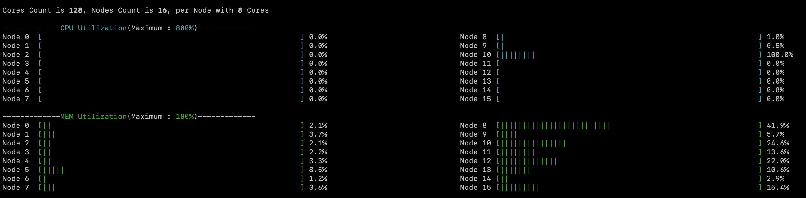
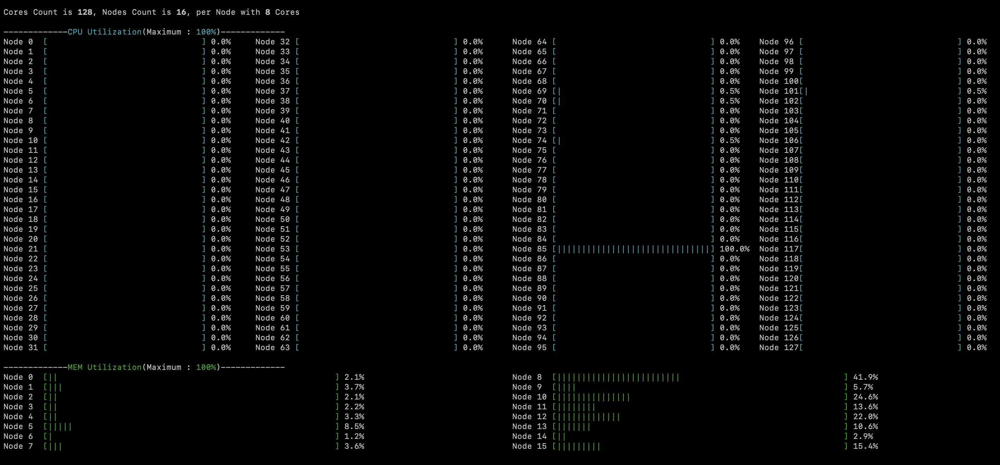

# Xuma
- Show CPU Utilization per Node or per Core
- Show Memory Utilization per Node
- Show CPU Utilization in one Noper per thread

### Usage
- Maximum of CPU Utilization depends on Cores' count per Node
- Press Keys to turn it into diffenrt Modes
- Press Up、Down、Left、Right Keys to select target Node, "Enter" to show %CPU per process on target Node
- n/N[default]	: CPU Utilization per Node
- c/C		        : CPU Utilization per Core
- q/Q		        : quit

### Sample
- Per Node [default]

- Per CPU

